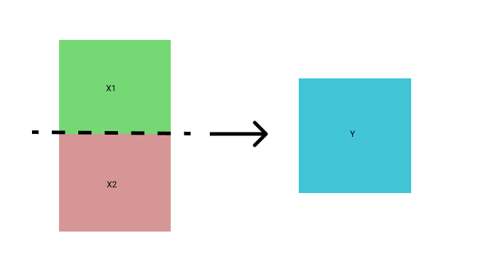
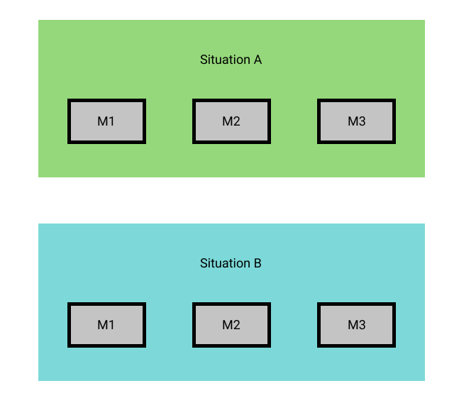
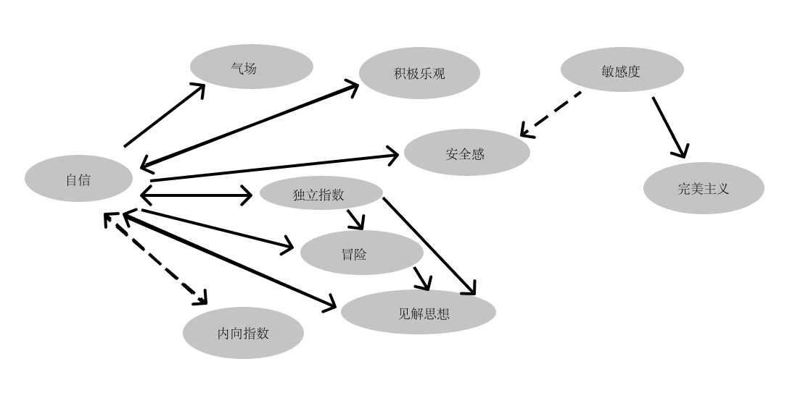
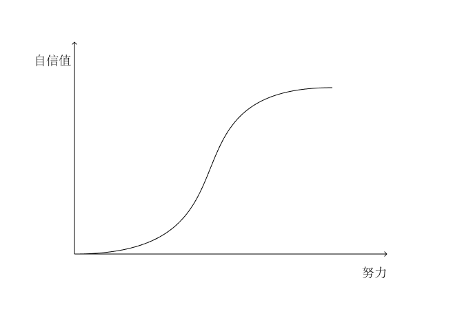

# 自手术记

**免责声明：本文存在血腥内容，如有引起不适请立即停止阅读；儿童请在家长陪同下阅读；不安全操作，请慎重模仿。**

一个月前的夜晚，火车上，我像沙滩上濒死的鱼一样大口呼吸时，它冲进了我的嘴巴里。习惯性地咀嚼了几下，“吧唧吧唧......”，在顺着喉下咽的那一刻，我才意识到，“我艹，他妈是只苍蝇”。

我反复漱口，又喝了一杯开水，外加一口白醋，总算是压制住了恶心。

但很不幸地是，在几天后这个携带各种病菌的外来异物，诱发了我的旧患，让自己在近一两个多月来痛不堪言、精神涣散，在最受折磨的时候我甚至是妄图以痛至痛的方式来减小触摸不到病灶机体上的痛感。而这也是我第一次意识到自己已经病到这个地步。

以前呢，我周围都是亚健康的人，我根本就意识不到自己身患疾病，一度认为人或多或少总有些毛病，就像左右腿的长度都存在差异一样。即便是我意识到自己和其他周围的人都患有疾病，我更多地认为那是先天的毛病，后天也没办法去治愈，就像先天性心脏病这类的疾病。

直到最近很久一段时间，我有着长期亲密地接触到一个趋近于健康的正常人的经历，虽然其本人也有着其他的小毛病，但是没有像我或我周围大部分似的，在机体功能性上存在疾患。这一下子让我看到了鲜活的生命气息，让我感受到的健康而鲜活的生命力应有的样子。于是，我下定决心，要让自己摆脱旧患，康复成一个正常人。

起初，我是准备在找杭州市内比较不错的专家和医生来给我做诊断和治疗，经过几番的咨询和调查，锁定了几家治疗机构，但是考虑到治疗会存在的手术风险和治疗成本，最后我决定大胆一次， 自己来一次 DIY 手术。
作为一个从小就有着比较不错的动手能力的人，对于这种实操是具有极大的兴趣的，以前可能是处理手机等电子设备的故障，或者是软件程式的 Bug，这一次将尝试一次人体手术，而且只要是我能够在短期补足这方面的知识，我有信心能够完成对自己的诊断和治疗。

在开始行动之前，我一边饮鸩止渴般通过转移痛感来缓解病痛，一边学习着与疾病和手术相关的知识，具体的参考资料和书籍，我将在文末给出，有兴趣的朋友也可以学习参考。

在进行了几天的学习后，我便开始了对自己的“诊断-手术-治疗”。这里“手术”即是诊断的方法，帮助发现病原，同时具备一定的治疗效果，比如切除局部的病灶。

## 指标测量与分析

体检和指标测量是分析病情和病因的必要手段。这里一部分数据是来自于现代的科学仪器测量，一部分是来自中医中的“望闻问切”，这里与我所患病症相关的主要指标基本都是使用后者来测量，现代的科学仪器目前还不能有效的对部分指标进行测量。

**基础指标**

| 检查项目     | 测量结果         | 单位 | 异常描述 | 正常参考值    | 缩写 |
| ------------ | ---------------- | ---- | -------- | ------------- | ---- |
| 身高         | 181.0            | cm   |          |               |      |
| 体重         | 57.9             | Kg   |          |               |      |
| 体重指数     | 17.7             |      | ↓        | 18.5 -- 23.99 |      |
| 收缩压       | 120              | mmHg |          | 90 -- 139     |      |
| 舒张压       | 70               | mmHg |          | 60 -- 89      |      |
| **初步意见** | **体重指数降低** |      |          |               |      |

| 检查项目               | 测量结果 | 单位          | 异常描述 | 正常参考值    | 缩写 |
| ---------------------- | -------- | ------------- | -------- | ------------- | ---- |
| 白细胞计数             | 5.2      | $$10^9/L$$    |          | 4.0 -- 10.0   | WBC  |
| 红细胞计数             | 5.20     | $$10^{12}/L$$ |          | 4.50 -- 5.50  | RBC  |
| 血红蛋白               | 152      | g/L           |          | 120 -- 160    | Hb   |
| 红细胞比容             | 46.6     | %             |          | 38 -- 51      | HCT  |
| 平均红细胞体积         | 89.8     | fL            |          | 80.0 -- 100.0 | MCV  |
| 平均红细胞血红蛋白含量 | 29.3     | pg            |          | 26.0 -- 38.0  | MCH  |
| 平均红细胞血红蛋白浓度 | 326      | g/L           |          | 300 -- 400    | MCHC |

**切尔西测试**

我的切尔西气质类型为：[INTJ](http://tg.chouti.com/answer.jsp?type=INTJ)。

在近2年内，我曾进行过多次的切尔西气质类型测试，毫无疑问每次都是得到一致的结果：`INTJ`，相对来说，这是比较稳定且可靠的测试结果。

**特殊指标**

*所有指标均为10分制，在无特殊说明情况下，指标值越大其反应的结果越正向*

| 指标名称     | 测量结果 | 描述                         |
| ------------ | -------- | ---------------------------- |
| 自信         | 5        | 存在外界波动                 |
| 自卑         | 5        | 存在外界波动                 |
| 敏感指数     | 9        |                              |
| 独立指数     | 3        |                              |
| 安全感       | 3        |                              |
| 内向指数     | 9        |                              |
| 乐观指数     | 5        |                              |
| 完美主义     | 9        | 几乎是病态完美注意，弊端极大 |
| 人格边缘指数 | 7        |                              |

这里我重点关注的是特殊指标，这个是与我所患疾病存在最直接的关系。

看到上表的指标数据，其实是很模糊的，因为大部分值都是中性的，因为在测量时是将自己的不同时期的指标值求的均值，其实这个结果不具备研究问题的参考价值。因为均值不是真是值，它会模糊掉大部分的事实情况，但是遗憾的是测量时是有自身机体经过大脑后的输出值，是一个直接的均值。

均值结果如下图，$$Y$$值对我们没有太多的意义，我们希望能够得到$$X_{1}$$，$$X_{2}$$的值，也就是我们需要找到虚线所代表的具体含义。

公式描述：$$Y=\frac{ Z_{1}X_{1}+Z_{2}X_{2} }{Z_{1}+Z_{2}}\qquad$$

后来，我自己注意到一个重大问题：特殊指标在测量时会因环境不同而存在巨大差异（我最早的环境差异就是特指的工作状态与生活状态，后来的研究中发现这个环境的划分是错误的），其实把这个差异找出来，我就可以拨开均值化过程，得到指标的真实值。

也正是这个问题的发现，才让我能够了解清楚自身的情况。其实，在最早的研究过程中，我并没有系统的发现这一点，在我准备手术前，反复地比对指标数据时才豁然开朗起来。而且在早期，我只是认为我在某几个指标上存在这种情况，我认为这个环境变值与指标变值就是因果，是环境直接导致指标结果的差异。

为了方便表示，我使用$$S$$表示环境，$$M$$表示指标真实值，$$Y$$表示指标表现值。

公式描述：$$Y=SM$$

实际上，在我仔细的研究了我的病机后，我又有了一个重大的发现，那就是：我有大部分的指标都存在着受到环境的影响，而且这些指标的背后会存在某种直接或间接的联系，再就是，环境变值与指标变值，而是相关性表现，也就是说，是存在某个或几个直接指标受到环境的影响会发生变化，而这几个指标是一个变量值输入到我这个机体中，从而导致了上诉的大部分指标发生改变。

从上图我们可以很清楚的看出，指标$$M_{2}$$和$$M_{3}$$在不同环境下具有不同表现值，并非有环境直接导致，而是受到指标$$M_{1}$$在不同环境下的变化的影响。

公式描述：

$$Y_{0}=\underbrace{Q_{01}SY_{1}M+Q_{02}SY_{2}M+...+Q_{0n}SY_{n}M}_{n}$$

其中，$$Q_{0n}$$为指标0受到指标n的影响系数。

具体的指标值及含义我会在下面逐一说明。

## 手术台上的病理分析

由于是旧患且病情严重而复杂，我决定采取积极治疗的手段，在看了些许手术操作步骤和相关知识后，便同时穿上白衣大褂和病号服，给自己来了一场自手术。

### 指标说明

##### 1. 自卑与自信

自卑与自信是两个相对的指标数据，我在研究自信时会同时的考虑自卑因素。

我的量表数据指标中自卑与自信的表现结果值均为5，而且我很容易能够找到这个均值结果前的真实值。

在工作中，或者说在运用技术性技能时和在生活中是两个外界环境因素，我对这两个指标进行了重新的单一环境测量，结果如下：

| 环境   | 指标名称 | 测量结果 |
| ------ | -------- | -------- |
| 工作中 | 自信     | 8        |
| 工作中 | 自卑     | 2        |
| 生活中 | 自信     | 2        |
| 生活中 | 自卑     | 8        |

从上表的结果看，我在工作和生活中完全呈现出两种不同的状态。另外，这里的工作指的是技术领域，生活指的是非技术领域。简单的理解来说，前者是非人对象中心事件集合，后者是人对象中心集合。

在工作上，我更倾向于接受新的技术和难题的挑战，不管是用一个新的方法来解决问题还是介入一个全新的领域，我都充满这激情和信心。 一般我会向同事传达和灌输我的想法和思路。比如对产品的理解上，我曾经就经常向我们的产品经理同事表达，这个产品应该具备哪些功能点，现有的地方哪里不合理。其实在这背后，都是由于我有足够的自信并且有不自卑的心态。

经过我不断的分析和研究，我找到了这个自信的直接来源，这些点对我研究在生活状态下的我具有极大的参考意义，这在我对自己的治疗方案中具有极大的参考价值，

1. 我善于观察和研究事物并充满着极大的好奇心
2. 我靠着自己从机械设计到电子电路设计再到软件开发，非常清楚自己想要的做出来是什么，并通过学习其他技能来实现它
3. 在技术上具备较为丰富的知识面
4. 使用很多优秀的产品和功能

*工作中自信图*

这面这几点基本上能够展现出我为什么在工作中状态会比较自信且具备一定的风险判断和管理能力。

但是目前来说比较糟糕的是，一回到生活状态，我的情况会变得极其糟糕。我拒绝陌生，害怕改变，对别人的意见（非原则性）言听计从，对不熟知的事物几乎没有自己的想法和见解。这与在工作状态中的我是截然相反的人格表现，我曾经一度以这就是星座论的自我常态来麻痹自己，认为生活中这个人格表现的我才是本我，工作中只不过是一个完美主义者的幻像。随便提下，星座论的背后是人格特性，其成因来自于原生家庭占比较大，但是大部分特性都是可以通过后天自身的学习来提高的，希望我们不要被所谓的星座论所羁绊。

直到我开始认真地分析自己的病情时我才发现事实情况并非之前所认为的那样。两种环境下状态的人格思维模型其实是相同的，而且是符合人格一致性，是环境作为一个人格输入因素发生了变化，从而导致人格表现存在巨大反差。

为了深刻地理解并改变生活中的自我人格，我先观察并整理，在生活环境下我的表现，

1. 拒绝陌生，不管是地方还是人，去陌生地方我可能需要预先查询很多遍信息，确保自己不会出错。
2. 在生活中难以做决定，犹豫不决，或是让别人来做决定，甚至是选择从众（比如根据评分高低筛选）。（工作环境中的我具备自己的一套决策体系，做决定相对来说比较轻松。）
3. 容易紧张和焦虑，缺乏安全感。
4. 容易悲观，习惯从悲观面看问题。

我进行过长时间的归纳和总结，再结合在工作上中的状态来看，我长期处于自卑情况的一个重要因素是我的身型。除了一个人外，几乎每一个和我有过长期接触的人都会跟我说，我太瘦了。在我的理解逻辑下来看，从来没有觉得这会影响到我的人格发展，但是我现在回溯起来，发现身材的确影响了我，它是影响我的自信的一个重要原因。在人类进化的过程中，体格健壮的审美基因早就被固化了下来，我的原始意识也是希望自己拥有健硕的身型。缺乏强壮的身体，在我的思维逻辑里面，自然就形成了一种弱化冲突的思维逻辑。因为在生活中，第一且重要的就是自己的肉体本身，这相当于是自己的第一技能。长久下来，我形成了2个思维逻辑，

1. 身型瘦弱，不被人欣赏，害怕被嘲笑
2. 不强壮，不能很好的处理突发情况，包含但不限于肢体冲突等

正是在这2个思维的影响下，我一直都是避免过多的人际交往，过多的进入新的环境和领域，更倾向于选择我能完全掌控得了的领域（工作），或者至少是熟悉的环境和人进行相处和活动。进一步地，我拥有的新的生活知识和技能也不会增加，同时也不能真正的去接触外面的世界，我就更加不能进入新的环境，永远的封闭在自己的舒适区，如此恶性循环。

*生活中自卑图*

与自信和自卑相关的特性还有：谨慎指数、冒险指数、紧张指数等，这些都是与自信指数呈负相关，我就不一一表述。

##### 2. 敏感指数

敏感指数，这个在心理学上又有很多其他的表现，如，同情心、同理心等。敏感这是一个能够了解、洞察和预测他人或社会行为和心理的能力。大部分情况下，他是具备比较高的积极意义，但是物极必反，我了解到无限放大同理心或同情心对自身的生活和身心是带来比较多的负面影响。

就我自身而言，我有着极高的敏感指数。我记得在我特别小的时候（三四岁），我姐特别调皮，也不听话，有时候母亲气不过就会用动手打姐姐，那会我边拉着母亲阻止她，边自己模仿母亲的抬手动作打着自己来感受被打的感觉。有时候不希望看到姐姐挨打，甚至会让母亲来打我。这就是比较直接也典型的同情心理。在我有记忆以来，我一直都有着模仿别人受到痛苦的行为，企图用自身来理解这种痛苦。虽然从理性的角度讲，这个行为没有缓解别人的痛苦，但是我自身一直在重复着这样的事情，企图体会别人的感受。

但是，我也不晓得是为什么，对于快乐的愉悦的事情，我并没有这种换位感受过，比如我从来就没有看到别人因为做了某件事而喜悦，然后我自己也去模仿做某件事去。这里有可能是自卑限制行为的力度大于高敏感的换位冲动。目前，我还没有花时间来研究这个点，但是我从直觉上来看，并非上面的猜测，可能更多的是因为，对痛苦此类感受的敏感度远大于其他。

在生活中，特别是我觉得很亲近或亲密的人，向我表露出了一丁点的痛苦或不愉快，如果这个是由于我的行为或言语造成的，我会立即停止我的行为或语言的表达。

虽然现在并非所有的痛苦都可以做到切身体会，但是我会立即详尽办法去减少别人的痛苦。这个行为的原始动力目前我还没研究透，但是有一部分，是对自己的自责，认为别人的痛苦是来自于我自己。

换个角度来看，敏感度越高，也意味着好奇心越强，因为好奇的前提就是要善于发现新或细微的变化。

我很喜欢从细节发现问题而带来的心理满足与快感。我最常做的事情就是，拿到有限且极少的信息去收集更多的有效信息，对于人来说，在专业术语里叫做社会工程学，简称社工。这个行为的原始触发点，其实还是由于自身缺乏安全感（我会在下面分析到）。心理需求就是需要更多的信息来佐证自己处于安全区域。

比如，小N在之前进行了一个二手商品的交易，由于商品的特殊性，没有走第三方平台，直接线下交易。但是这个过程极其波折，来来回回折腾了很久，我们甚至一度怀疑是不是被骗了。我在拿到了卖家的非常有限信息（姓名）后，我便开始进行收集卖家个人信息，从最后拿到的结果（性别、身份证号、其姐姐的部分信息等）来看，最终判定卖家在信用上是没有问题，那我们就可以放下顾虑。但是我回过头来看，我凭借着对信息的敏感和部分的技术方法，确认了某个事务的状态，但是我的这些操作并不能改变其状态。举个例子，我看了一眼盒子里猫的颜色，并不能改变其本身的是白猫还是黑猫，所以大部分情况下，这种高敏操作并没有什么实际用处，反而大大增加了焦虑感。

长期在这种存在“剧透”的情况下，进行的抉择后，导致了我一个很恶劣的思维逻辑：几乎很难对存在可能性的事情做肯定性的决定。就好象，我几乎不买彩票。

从这里看似乎是件好事情，但事实并非如此，因为我过于保守或追求稳操胜算，让我错过了很多有可能成功的事情。也就是大家常说的冒险，人生是一个不断冒险和试错的过程，然而我却试图一味地去追求按部就班、稳操胜算，在人生中是鲜有这种事情。针对这一点，我将给自己制定了一个详细的治疗方案。

##### 3. 独立指数

这个很好理解，在我身上这个指数值应该是非常的低。这个独立指数，指的是独自应对和处理问题的能力和欲望。

我喜欢独处，但是在生活中我又害怕独自去面对和处理问题。在以前，我不管做什么都喜欢找人一起，其实并不是别人能够给我提供帮助而是自己在心理上找到了慰藉点：我并非独自行动。事情的结果一般也都是我独立的完成和处理，但是我自己让这个结伴的人给了我心理上动力，或者叫抑制住了心理上的恐惧。

在我为数不多一些出行经历来看，我如果是独自出行和处理事情的话，一般都是心无旁骛，直奔主题，事情结束后立即将自己放回到安全区域。

反观在工作中的自我表现，是非常喜欢独立行动的，而且很享受这个过程。究其缘由，不外乎是，

1. 自信
2. 有独立的知识体系
3. 能够应对各种突发情况

其实分析下来，这个独立指数的影响因素其实就是自信影响因素的子集。甚至，我们可以理解为，独立就是自信的一部分。

那总结下来，我在生活上的不独立，有一下原因，

1. 不自信
2. 知识不够系统，缺少对外界的认知

基本上，这也是一个恶性循环，越缺少独立活动，就越不能形成系统性的知识，越没有自信，就更加不能够进行独立活动。

所谓的路痴，其实就是缺乏系统性的知识，面对混乱和密集的建筑群缺乏识别能力。一个人如果是路痴，那基本上也就是缺乏独立能力。

对于我自己，我在治疗方案里面，会给自己一个如何快速提高独立指数的治疗方案。但是并非照搬照抄就能够适用与其他人，需要和我的分析过程一样，找到最核心或者叫最容易攻破的人格缺点来提高和完善人格属性。

##### 4. 安全感

安全感，这个在不同的心理学派中有着不同解释。以我的理解来看，我把安全感等同于负相关的危机意识。他的最大值就是杞人忧天，无中生有的危机。
同样的这个指标，基本上也是受限于，自信与乐观指数。

就我自身而言，安全感偏低，在生活上当然是自信的缺乏，认为事情永远会向不利于自己的一面发展。另外，还有一个我观察到的心理现象，如果我对某件事情的重视度越高，那我在他上面获得的安全感就越低。很直观的描述，如果我在某见事情上投入的成本越大，那我会越重视这件事，接下来这件事情让我获得的安全体验就越低。经过我几天的分析，我基本上可以判断，这个是由于我的高敏感心理发现了风险机率的存在，同时自卑和不自信又放大了事情本身存在风险机率，那么结果就是降低了安全感的指数。

还有一个心理现象就是，越注重某件事，那么这件事的成功率则越低。看起来有点不可思议，但其实是这样子的。对事情来说，越重视，内心就会越焦虑，出错的概率就会越大。对人来说，越看重和他的相处，就会越焦虑，在他面前就越频频出错，就表现得越不自信，自然自身的吸引力就越低。

##### 5. 内向指数

内向指数，就是与人陌生人沟通的能力和倾向。我是典型的内向者。

这个内向并不是说是与生具来的，对我来说成因如下，

1. 我以前很自卑，所以我害怕何人交流；
2. 我由于缺乏独立活动，导致我没有形成很多的独立思想和知识体系，这让我没法和人进行有价值的交流。

以上两点是我内向的两点重要原因。

其实还有一点，由于我缺乏自信，也缺乏独特知识体系，导致我在人际交往中形成了一种叫做，讨好型社交人格。很多研究里说这个是从小形成或原生家庭导致，但我在研究我自身时，发现我形成讨好型社交人格的主要因素，就是我自身呢已经意识到我具有内向倾向，所以我需要通过其他途径来完善我的社交功能，讨好行为就是其中一个。

这里我不再赘述，因为我知道我怎么去解决我自身的内向问题。

##### 6. 乐观指数

这个我还没有仔细的去分析，我先给出结论，

1. 工作中，乐观指数高
2. 生活中，乐观指数低

原则上与自信成正比，但是他的成因还有很多额外因素，而且乐观指数过高会在社会效能中带来消极的影响。

##### 7. 完美主义

毫无疑问，我属于典型的完美主义，我先说坏的影响，

1. 延期
2. 因小失大

典型的，我应该是属于病态完美主义，直接点就是有可能会吹毛求疵，过于控制细节。无可厚非，这的确在工作中给我带来了很多优秀地方，但是也极其容易让我失去对结果的把控，不得不说，我已经有好几个项目是死在了我的病态完美。其实最好的完美不是过程完美，而是结果优秀。

对于完美主义，我目前还没有好的策略和治疗方案。

##### 8. 人格边缘指数

就是边缘性人格，在心理学上给的定义是，长期的不正常行为，例如不稳定人际关系，不稳定自我认知及不稳定情绪。这句话看上去就是句废话，结合维基百科给的[边缘性人格障碍](https://zh.wikipedia.org/wiki/%E8%BE%B9%E7%BC%98%E6%80%A7%E4%BA%BA%E6%A0%BC%E9%9A%9C%E7%A2%8D)的解释，
至少有三项符合冲动型诊断标准，且至少符合以下两项边缘型标准：

1. 在自我形象，目标，内在喜好上的障碍与不确定。
2. 易涉入紧张且不稳定的关系，且导致情绪困扰。
3. 强烈的避免被人遗弃（按：害怕分离）。
4. 以警告或动作，不断出现自我伤害（按：以避免分离）。
5. 持续的空虚感。
6. 出现飙车，药物滥用等冲动行为。

就我自身来看，在很多方面非常符合边缘型的定义，比如，2、3。其实在这个边缘型表象的背后，依然是前面叙述的几点因素导致，这也就是为什么在心理学上存在某个特性后，必然会存在后面一系列的心理特性。

### 案例分析

下面我分析几个我的实际例子，来分析我的实际情况，因为里面会有很多小的点，不在上面的指标分析里。

**案例1**:

在前不久，小N的几个很重要的朋友来杭州，我准备请他们一起吃饭。由于很少有这种会见客人的场合，所以我特别纠结和犹豫在什么地方吃饭，吃什么。首先，我用点评类的APP打开，搜索周边的美食，我选择了交通方便且评分高的地方。最后，筛选出杭州酒家（3楼）。但是在我进到店门时，我又再次打开的APP，看看别人对这家的评价，我特别留意到，一个评论说，3楼比较一般，没有楼下好。我在看到这条评论时，我马上决定在楼下就餐（入座后才意识到，就餐环境，但是考虑到沉没成本（等座30分钟），我并没有提出更换就餐地点）。在面对陌生和环境时，我的潜意识里认为高度越高存在的风险就越大，也就是在举棋不定时的一个选择低楼层决定的支撑理由。在聊天时，我基本处于被动的状态，基本没有进行主动沟通的活动。2两很重要的原因，第一是缺乏自信，每一次主动对外沟通都是在对外暴露自身不足和缺点；第二是阅历不足，缺乏交流素材和经验，侃侃而谈也是我寄予希望的样子。

**案例2**:

也在之前的某个时间，我突然发现我的某个同事的头像变了，这个引起了极大的注意（我平时经常留意这些细节），因为基本上该同事的头像有好几年都没有发生调整，而且新换的头像也特别有意思，是一张让人心旷神怡的风景图。

这让我察觉到，该同事可能最近在纠结于某些事情。我甚至在心里想，是不是由于我做错了什么事情，导致他最近遇到了麻烦。当然，这种可能性很低，但是我的第一心理活动，就是我的错误导致了什么结果。

上面的案例基本还是围绕前面说的几点，也非常符合我自身的心理机能的处理逻辑。

## 康复治疗手段

下图是与我相关的几个指标关系。

我参考工作中我的状态，首先需要将生活中的我提升至同样的水平。

我把自信比作发动机，得先有一个原始动力（想一想机车的一脚蹬，柴油机的手摇杆），让它动起来，它便可以带动其他的各个部件持续活动。在工作或者说技术上，我的原始动能，就是我在机械专业搞电子电路，这让我很轻松地能够在群里内获得自信，有了初步的自信后，也让我接触其他各类知识变得非常容易。
在生活中，我认为我的原始动力，应该就是身型的改变。

1. 就是减少由于身型瘦带来的自卑，自卑是每个人前进的动力，所以我不可能做到不自卑，所以我决定将这个自卑点提升为自信点，所以我需要去强身健体，去拥有让人获得自信的身型和体魄。这个对解决我的问题是一个很关键的方案，从图上可以看出，自信提升了，很多问题自然就迎刃而解。
2. 由于这个过程是比较缓慢的，所以在实施这一治疗方案时，我需要同时的去将自己置身到不完全可控的环境中，弱化思维定势中的，陌生等于危险。毕竟所有的地方都是危机和挑战并存。
3. 在所处的环境和经历的事情多后，在生活上自身的见识和知识体系自然就得到了提升，同时又给自信一个正反馈。

下面是拟定的成长曲线图，

我给自己的核心治疗方案就是，提高对身型的自信。当然不可能靠思想的改变，我通过健身和练习攻击技巧来达到我的需求。虽然目前就锻炼本身来说没有实质的提升，但是我在提前消耗多巴胺时，已经得到了比较不错的反馈。

接下来，我再解决我主要存在的其他重要但不紧急的问题：

1. 病态完美主义
2. 过度敏感

目前在第一期治疗方案中，不进行处理。

## 后记

康纳·麦格雷戈说，你应该想着你实现目标后样子，然后不断去努力。
小N说，到了山顶，我们就有冰镇的可乐。

最后，我特别感谢一直教导提醒我如何面对自我、如何面对生活、如何处理亲密关系以及陪着我欢欢闹闹地走过一段旅程的小N。也正是小N的积极向上的人生观和成熟且健康的心理状态让我有所顿悟同时也看到生命力的样子。同时也非常感谢，小N在我迷失自我认知和失去对生活的判断力甚至是具备极强的情绪攻击冲动时，自身忍受着巨大的委屈和痛苦，依然没有放弃对我的信任、理解和帮助。感谢在我精神状态欠佳时，同事们对我的关心和开导。

火车上，我像沙滩上濒死的鱼一样大口呼吸时，它冲进了我的嘴巴里。习惯性地咀嚼了几下，“吧唧吧唧......”，在顺着喉下咽的那一刻，我才意识到，

“我艹，这橘子真甜”。

“再给我来一瓣。”

## 参考文献及资料

1. 《自体心理学导论》
2. 《自体心理学的理论与实践》
3. 《自体的分析》
4. 《动机与人格》
5. 《爱的艺术》
6. 《两性关系》
7. 《佛洛伊德文集》
8. 《佛洛伊德五大心理治疗案例》
9. 《自我形成论》
10. 《自体的分析》
11. [我是誰-心理學的永恆難題 Medium文章](https://medium.com/@haitaibear/%E6%88%91%E6%98%AF%E8%AA%B0-%E5%BF%83%E7%90%86%E5%AD%B8%E7%9A%84%E6%B0%B8%E6%81%86%E9%9B%A3%E9%A1%8C-4aa8fbf786d4)
12. [人格心理学 PPT](http://203.64.138.3/~webadmin/tsite/data/user/career/files/201410281017243.pdf) 林上能
13. [人格心理學概要](http://lms.elearning.tw/sysdata/28/328/doc/2ac57be85060652a/attach/2141.pdf) 輔仁大學心理系副教授 陸洛